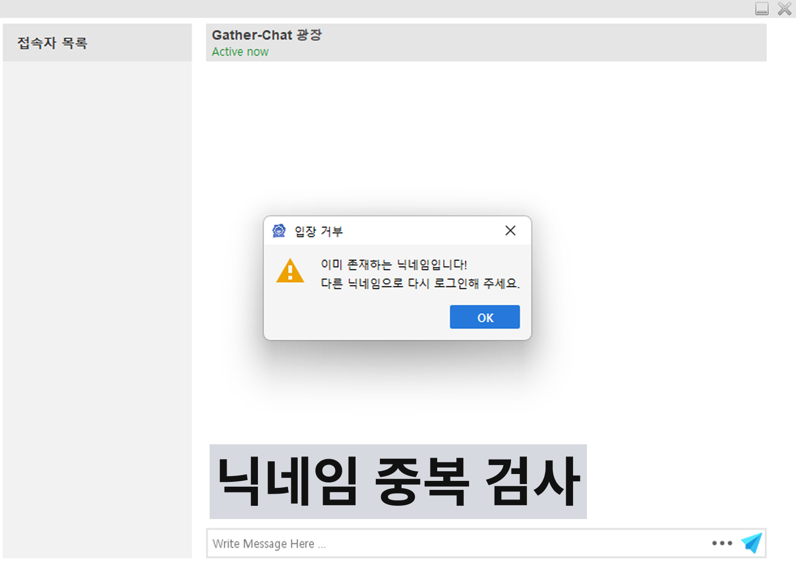
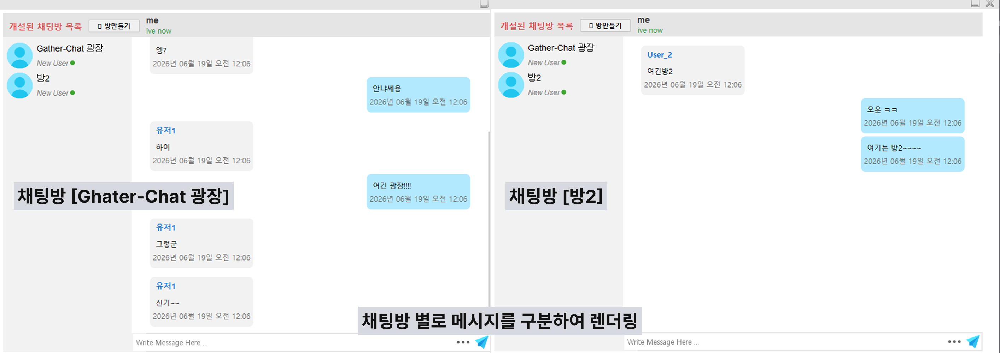
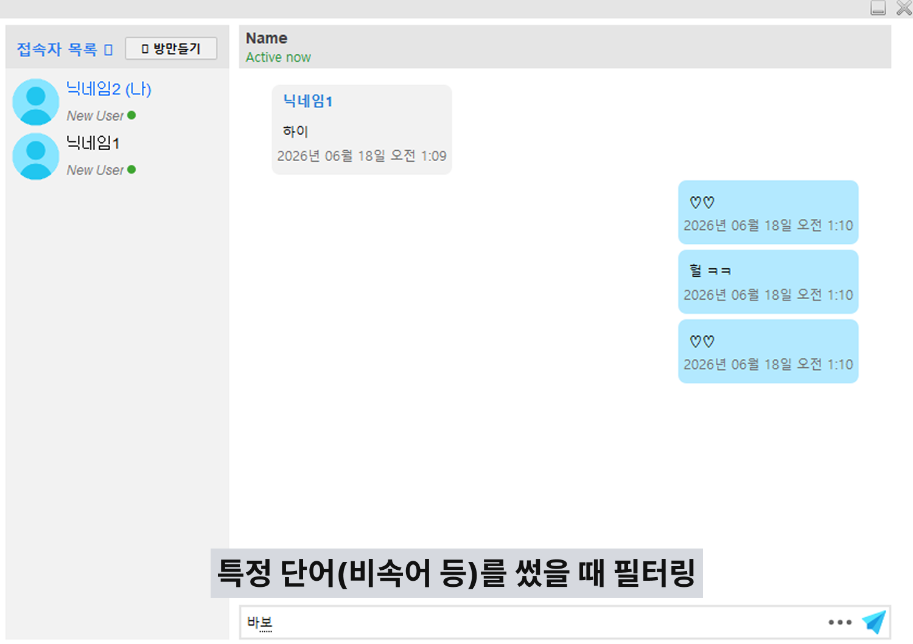
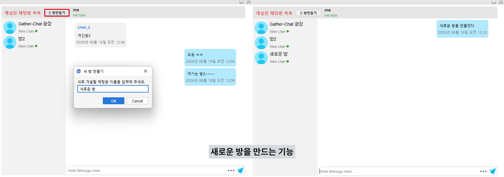
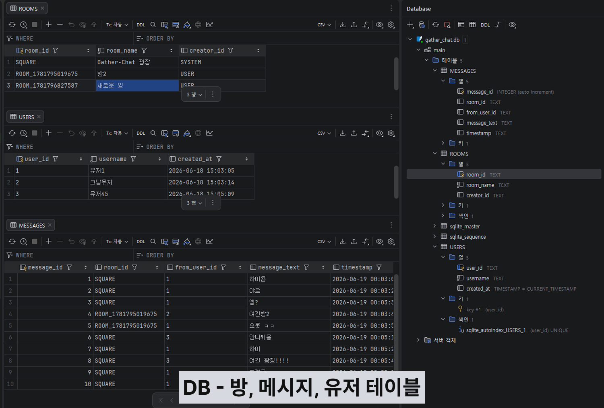
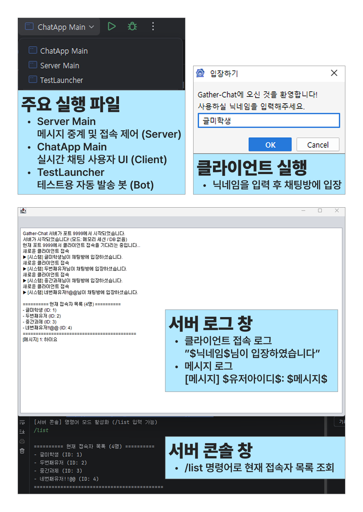
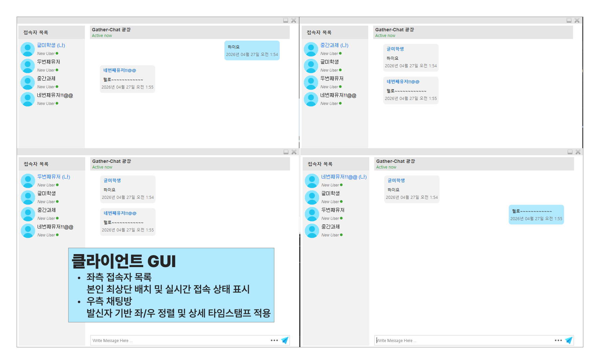
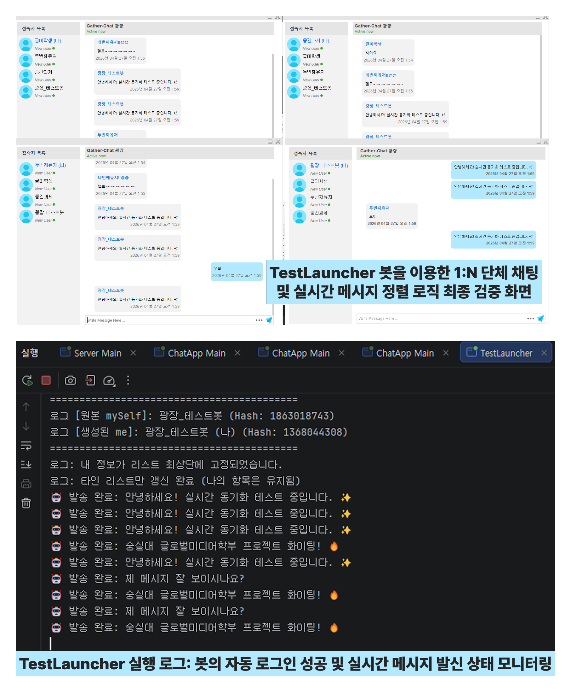

# 🛡️ GatherChat

## 1. 프로젝트 개요

- **프로젝트 명** : GatherChat
- **개요** : 기존의 1:1 대화 중심 채팅 구조를 탈피하여, 모든 접속자가 하나의 공유 공간에서 소통할 수 있는 **1:N(다중 접속) 단체 채팅방**으로 재설계한 프로젝트입니다. 별도의 데이터베이스(DB) 연결 없이 **런타임 메모리와 실시간 소켓 브로드캐스팅**만으로 유저 목록과 채팅 데이터를 동기화하도록 구현되었습니다.

## 2. 사용한 주요 자바 개념

> ### 🚀 [26.06.19. 업데이트] 데이터 영속성 및 네트워크 하이브리드 설계
> * **JDBC & SQLite Connection**: 파일 기반 임베디드 DB를 연동하여 서버 재부팅과 무관한 데이터 영속성(Persistence) 확보.
> * **Java HTTP Server (`HttpServer`)**: 소켓 통신과 별개로 과거 대화 내역 조회를 효율적으로 처리하기 위한 내장 REST API 서버 구축.

- **객체 지향 프로그래밍 (OOP)**: 메시지 및 유저 정보를 객체화하여 데이터 관리의 효율성 증대.
- **싱글톤 패턴 (Singleton Pattern)**: 공용 `Service` 클래스를 통해 소켓 세션의 유일성 보장.
- **멀티스레딩 (Multi-threading)**: 서버 수신 대기 스레드와 UI 렌더링 스레드를 분리하여 끊김 없는 사용자 경험 제공.
- **Collections Framework**: DB를 대신하여 유저 명단을 메모리상에서 관리하기 위한 `ArrayList` 등 활용.

## 3. 클래스 구성 설명

본 프로젝트는 클라이언트와 서버가 독립된 모듈로 구성되어 있으며, 각 사이드의 핵심 클래스 역할은 다음과 같습니다.

### **[Client Side: chat-application]**

> ### 🚀 [26.06.19. 업데이트]
> * **`com.raven.component.Chat_Bottom`**: 메시지 전송 컨트롤러입니다. 서버의 Map 기반 리스너 규격에 맞춰 메시지 데이터(`MessageType`, `roomID` 등)를 JSON 형태로 정밀 직렬화하여 방출하도록 고도화되었습니다.

- **`com.raven.main.Main`**: 클라이언트의 메인 진입점입니다. `FlatLaf` 테마 설정 및 전체 UI 레이아웃을 초기화하며, 사용자로부터 닉네임을 입력받아 채팅방에 입장시키는 컨트롤러 역할을 수행합니다.
- **`com.raven.service.Service`**: 소켓 통신의 핵심 엔진입니다. 싱글톤 패턴으로 구현되어 서버와의 연결 세션을 유지하며, 서버로부터 전달되는 실시간 데이터(유저 명단, 채팅 메시지 등)를 수신하여 UI 이벤트로 전달합니다.
- **`com.raven.form.Home`**: 단체 채팅 환경의 메인 컨테이너입니다. 좌측 유저 리스트와 중앙 채팅 영역을 통합 관리합니다.
- **`com.raven.component.Chat_Body`**: 동적 렌더링 컴포넌트입니다. 수신된 메시지의 ID를 분석하여 본인 메시지는 우측, 타인 메시지는 좌측으로 배치하며 실시간 스크롤을 관리합니다.
- **`com.raven.main.TestLauncher`**: 검증용 자동화 클래스입니다. 별도의 스레드에서 가상 유저(봇)를 구동하여 1:N 브로드캐스트 환경의 데이터 정합성을 테스트합니다.

### **[Server Side: server]**

> ### 🚀 [26.06.19. 업데이트]
> * **`com.raven.service.DatabaseManager`**: SQLite DB 관제 커널입니다. 싱글톤 패턴으로 구현되어 서버 구동 시 `USERS`, `ROOMS`, `MESSAGES` 3대 테이블을 자동 빌드업하고, 유저 등록 및 메시지 적재(CRUD)를 총괄합니다.
> * **`HttpServer (REST API Context)`**: 포트 8080에 개설된 내장 HTTP 서버입니다. `/api/rooms` 및 `/api/rooms/{roomID}/messages` 엔드포인트를 제공하여 클라이언트의 과거 내역 요청에 JSON 배열을 반환합니다.
> * **`com.raven.service.Service` (create_room 리스너)**: 클라이언트의 새 방 개설 요청을 수신하여 타임스탬프 기반의 고유한 난수형 `room_id`를 생성하고, SQLite `ROOMS` 테이블에 안전하게 등록하는 동적 방 빌드업 이벤트를 처리합니다.

- **`com.raven.service.Service` (Server-side)**: Netty-Socket.io 서버를 구동합니다. 포트(9999) 바인딩 및 클라이언트의 접속/퇴장 이벤트를 감시합니다.
- **`com.raven.main.ServerMain`**: 서버의 시작점입니다. 서버 가동 시 콘솔 로그를 출력하며 전체 통신 인프라를 초기화합니다.
- **이벤트 핸들러 (Socket Event Handler)**: 클라이언트로부터 수신된 메시지를 분석하여, 접속 중인 모든 클라이언트에게 데이터를 재배포하는 브로드캐스트 로직을 수행합니다. (DB 없이 메모리 내 세션 관리 수행)

## 4. 실행 방법

1. `Server` 프로젝트 실행 (포트 9999 가동).
2. `Main.java` 실행 후 닉네임 입력 (접속 시 자동으로 'Gather-Chat 광장' 입장).
3. (테스트) `TestLauncher.java` 실행 시 자동 발신 봇이 광장에 참여하여 메시지 전송.

## 5. 주요 기능 설명

> ### 🚀 [26.06.19. 업데이트]
> * **채팅 데이터 영속화 (Persistence)**  모든 대화 내역이 SQLite DB 원장에 실시간 적재되어 서버가 꺼져도 데이터가 소실되지 않음.
> * **과거 대화 내역 자동 복원**  사용자가 채팅방을 이동(전환)할 때마다 REST API를 호출하여 해당 방의 이전 대화 기록을 복원.
> * **타입 우회형 좌우 정렬 알고리즘**  DB에서 받아온 사용자 ID와 내 로그인 ID를 문자열 기반(`equals`)으로 정밀 대조하여 내가 쓴 글(오른쪽)과 남이 쓴 글(왼쪽)을 분리 렌더링.
> * **중복 닉네임 가드 & 안전 기능**  동일 닉네임 입장 거부 기능 및 DB 오류 방지(`INSERT OR IGNORE`) 스펙 적용. 비속어 채팅 필터링 기능 탑재.
> * **실시간 신규 채팅방 개설**  사용자가 원하는 방 이름을 입력하면 소켓 리스너를 통해 서버와 DB(ROOMS 테이블)에 실시간으로 방 정보가 적재되며, 독립된 대화 공간이 생성됨.

- **1:N 단체 채팅**  특정 상대가 아닌 접속자 전체에게 메시지가 전달되는 광장형 채팅.
- **실시간 접속자 명단**  새로운 유저 입장 시 좌측 리스트에 즉시 반영되는 동적 업데이트.
- **메시지 분기**  서버가 브로드캐스트한 메시지 중 본인이 보낸 것을 식별하여 UI 정렬.
- **정밀 타임스탬프**  오전/오후 및 초 단위까지 표시되는 상세 시간 포맷팅.

## 6. 본인이 구현한 부분

> ### 🚀 [26.06.19. 업데이트]
> * **In-Memory에서 DB 영속화 구조로 백엔드 개편**  휘발성 메모리 세션 방식을 탈피하고 SQLite를 연동하여 영구 데이터 보존 레이어 설계.
> * **소켓 & REST API 하이브리드 아키텍처 구축**  실시간 채팅은 소켓(9999)으로, 대용량 과거 기록 조회는 HTTP REST API(8080)로 분리하여 서버 부하 최소화.
> * **데이터 파싱 트랩 방어 리스너 설계**  서버 소켓 수신부를 `Map` 구조로 전환하여 데이터 타입 불일치로 인한 이벤트 유실 문제를 원천 차단.
> * **멀티룸(다중 채팅방) 확장 인프라 구축**  단일 광장 구조에서 벗어나 사용자가 직접 방을 개설하고 이동할 수 있도록 동적 소켓 리스너 설계 및 DB 구조 확장.

- **1:N 구조로의 아키텍처 개편**   1:1 전송 로직을 제거하고 서버 중심의 전체 브로드캐스트 방식으로 네트워크 로직 전면 수정.
- **서버 ID 기반 본인 식별 알고리즘**  서버 부여 고유 ID를 비교하여 UI 렌더링 방향을 결정하는 동적 분기 로직 구현.
- **실시간 리스트 동기화 보완**  유저 접속 상태 변경 이벤트 발생 시 전체 명단을 재동기화하여 리스트 정합성 유지.
- **자동화 테스트 시뮬레이터**  1:N 환경의 부하를 테스트하기 위해 백그라운드 스레드 기반의 발신 봇 개발.
- **In-Memory 데이터 관리**  **별도의 DB 없이** 소켓 이벤트 통신만으로 유저 세션과 메시지 흐름을 제어하도록 설계.

## 7. 트러블슈팅 (Troubleshooting)

> ### 🚀 [26.06.19. 업데이트] 과거 대화 내역 복원 시 UI 정렬 미적용 현상
> * **문제**: 과거 대화 내역을 불러왔을 때, 내가 보낸 메시지임에도 우측 정렬이 되지 않고 화면 정렬이 꼬이는 현상 발생.
> * **원인**: SQLite DB에 저장된 ID(문자열형)와 자바 런타임 객체의 ID(정수형) 간의 데이터 타입 미스매치로 인해 `fromUid == myUid` 비교 조건문이 무효화됨.
> * **해결**: `Chat.java`에서 데이터를 대조할 때 두 식별자를 모두 문자열로 강제 변환(`String.valueOf`)하고 공백을 제거(`trim`)한 뒤, `.equals()` 메서드로 비교하도록 로직을 수정하여 타입 시비를 우회하고 정렬 정합성 해결.

- **문제**: 자동화 봇이 발신한 메시지가 본인의 창에서 '나'의 메시지로 인지되지 않고 타인 메시지로 처리됨.
- **원인**: 봇이 수동으로 생성한 메시지 객체에 `fromUserID`를 누락하여 서버로부터 돌아온 데이터가 클라이언트의 본인 ID와 일치하지 않음.
- **해결**: `Service`를 통해 서버에서 할당받은 실제 ID를 봇 객체에 주입하고, 서버의 브로드캐스트 정책에 대응하여 발신 시 UI 이벤트를 수동으로 트리거하여 본인 창에서의 정렬 문제 해결.

## 8. 실행 화면

> ### 🚀 [26.06.19. 업데이트] 
> ### 1) 닉네임 중복 검사 및 예외 처리
>
> 
>
> > SQLite USERS 원장 대조를 통해 동일한 닉네임의 진입을 실시간으로 차단하는 중복 검사 가드 화면
> 
> ---
>
> ### 2) 멀티룸 기반의 독립된 메시지 렌더링
>
> 
> 
> >REST API 통신을 통해 각 방의 고유 ID(room_id)에 해당하는 과거 대화 내역만 선별하여 화면에 분리 복원한 화면
>
>---
>
>### 3) 비속어 및 특정 단어 필터링 시스템
>
> 
>
> >부적절한 특정 단어나 비속어 송신 시, 하트 이모지(♡♡) 등의 지정된 대체 문자로 마스킹 처리하여 브로드캐스트하는 화면
>
>---
>
>### 4) 동적 신규 채팅방 개설 팝업 및 UI 동기화
>
>
>
>> '방만들기' 버튼 클릭 시 커스텀 다이얼로그로 방 이름을 수신하고, 소켓 이벤트를 거쳐 DB에 적재하는 동적 멀티룸 생성 화면
>
>---
>
>### 8) SQLite 데이터베이스 원장 구조 (ROOMS / USERS / MESSAGES)
>
>
>
>> 생성된 채팅방 정보, 유저 메타데이터, 실시간 대화 내역이 관계형 규격에 맞춰 영속화되는 SQLite 원장 데이터 그리드 뷰 화면
> 
> 
> 

### 1) 시스템 기동 및 서버 로그

> 서버 가동 및 다중 클라이언트 접속 시 발생하는 시스템 로그 모니터링 화면
---

### 2) 클라이언트 GUI 및 메시지 정렬

> 사용자 ID 식별을 통한 메시지 좌/우 자동 정렬 및 실시간 접속자 명단 동기화

---

### 3) 테스트 봇(TestLauncher) 검증 결과

> **Caption**: 자동화 봇을 활용하여 1:N 환경에서의 메시지 전송 및 수신 상태를 최종 검증

## 9. AI 활용 여부 및 활용 범위

- **활용 도구**: 바이브코딩 (Gemini)
- **활용 범위**
    - 1:1에서 1:N으로의 구조 변경 시 발생한 소켓 이벤트 중복 및 누락 로직 상담.
    - 다중 인스턴스 테스트 시 발생하는 세션 꼬임 문제(NullPointerException) 해결 자문.
    - README 작성을 위한 기술적 용어 정리 및 문서 구조 최적화 협업.

## 10. 원본 소스 코드 출처

- **원본 URL**: [https://github.com/DJ-Raven/java-swing-chat-application]